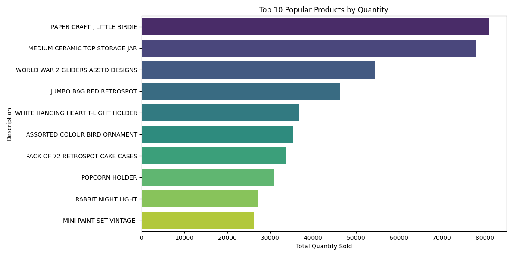
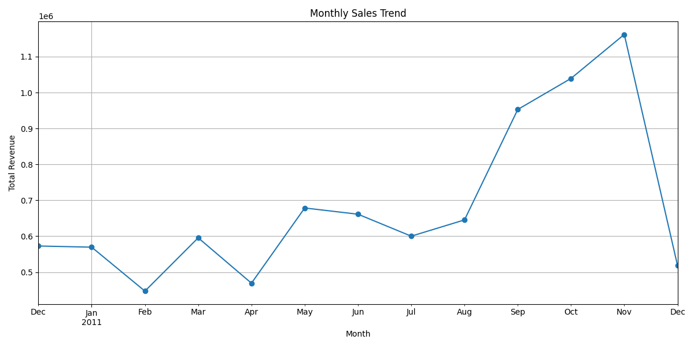
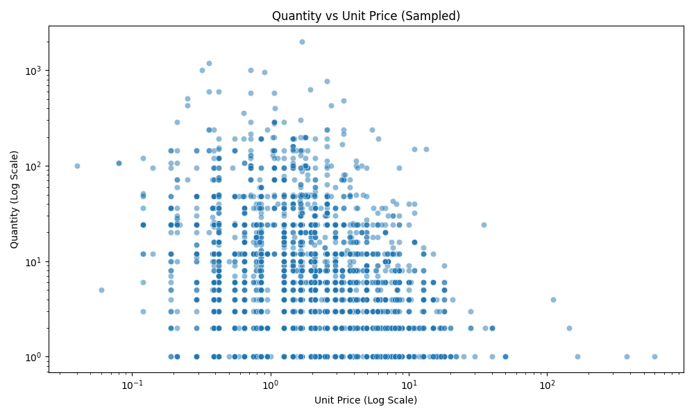
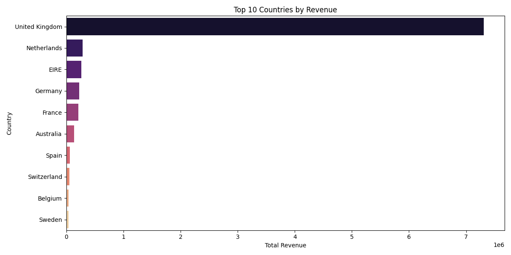

# Data Analysis Report: Online Retail

## 1. Data Exploration
**Dataset Overview:**
- **Rows:** 541,909 (Raw)
- **Columns:** 8
- **Missing Values:** 135,080 (CustomerID)

**Data Cleaning:**
- Removed records with missing CustomerID.
- Removed cancelled orders (InvoiceNo starting with 'C').
- Removed records with negative/zero Quantity or UnitPrice.
- **Final Cleaned Rows:** 397,884

## 2. Analysis Findings

### a. Popular Product Categories
*Top 10 products by quantity sold:*

### b. Seasonal Trends
*Monthly sales trend:*

- **Observation:** Sales show a significant upward trend towards the end of the year, peaking in November/December, likely due to holiday shopping.

### c. Correlation: Quantity vs Unit Price
*Scatter plot of Quantity vs Unit Price:*

- **Observation:** There is a general inverse relationship; lower-priced items tend to be purchased in larger quantities.

### d. Demographic Differences
*Top 10 countries by revenue:*

- **Observation:** The United Kingdom dominates the revenue share, followed significantly behind by other European countries like Netherlands and EIRE.

## 3. Conclusion
The analysis reveals that the business is heavily reliant on the UK market and experiences strong seasonal demand in Q4. High-volume sales are driven by low-cost items. Recommendations include stocking up for Q4 and potentially exploring marketing strategies to boost non-UK sales.
