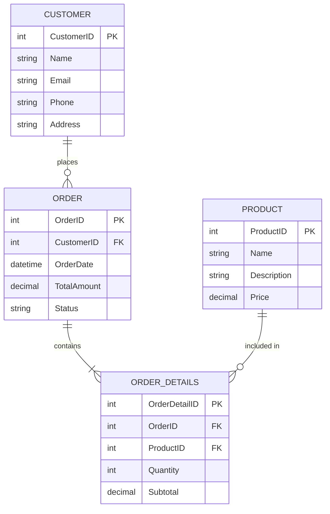

# Entity-Relationship Diagram (ERD)

```mermaid
erDiagram
    CUSTOMER ||--o{ ORDER : places
    ORDER ||--|{ ORDER_DETAILS : contains
    PRODUCT ||--o{ ORDER_DETAILS : "included in"

    CUSTOMER {
        int CustomerID PK
        string Name
        string Email
        string Phone
        string Address
    }

    ORDER {
        int OrderID PK
        int CustomerID FK
        datetime OrderDate
        decimal TotalAmount
        string Status
    }

    PRODUCT {
        int ProductID PK
        string Name
        string Description
        decimal Price
    }

    ORDER_DETAILS {
        int OrderDetailID PK
        int OrderID FK
        int ProductID FK
        int Quantity
        decimal Subtotal
    }
```
